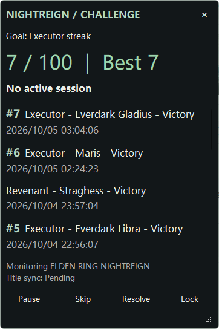

# Nightreign Challenge Tracker

Nightreign Challenge Tracker is a small Windows desktop HUD that watches the
Nightreign game window, records challenge runs, and keeps track of your streak.
You can also correct a run by hand if the app could not recognize its result.

<center></center>

## Install and start

1. Open the [latest GitHub release](https://github.com/guansss/NR-challenge-tracker/releases/latest).
2. Download the `Nightreign-Challenge-Tracker-...-windows.zip` file from the
   release's **Assets**.
3. Extract the ZIP into a folder you can write to, such as a folder in
   **Documents**. Keep the files together; the ZIP contains the app and its
   settings file.
4. Double-click **Nightreign Challenge Tracker.exe** to start the tracker.
5. Start Nightreign, or leave it running. Keep its game window visible and
   unminimized while you play.

The HUD stays above other windows. Drag it to move it and use the corner grip to
resize it. It shows your current streak, recent runs, and whether the game is
being monitored.

## While you play

The tracker looks for the Nightreign game window and watches for preparation
and result screens. It records runs automatically when it recognizes them.
Recognition depends on the game window being visible and using a supported
window-capture mode.

- **Pause** temporarily stops watching the game; choose **Resume** to continue.
- If a run is missed or recorded incorrectly, select it in the recent-runs list
  and choose **Resolve**. Check the character, boss, variant, outcome, and times,
  then save the correction.
- **Skip** discards the selected run (or the current run if none is selected),
  excluding it from streak calculations.
- **Lock** lets mouse clicks pass through the HUD so you can click the game
  underneath it. Press **Ctrl+Shift+L** to unlock it.
- Close the HUD with **×** when you are finished. Your run history is saved
  automatically.

## Optional: sync your Bilibili live-room title

Title syncing is optional. The tracker can update your room title to include
your streak, but this requires the Tampermonkey browser extension and an
additional userscript.

1. Install Tampermonkey in your browser.
2. Open [`app/integrations/bilibili.user.js`](app/integrations/bilibili.user.js)
   from this repository and install it in Tampermonkey.
3. Start the tracker and sign in to the Bilibili account whose room title you
   want to change.
4. Open the [Bilibili live center](https://link.bilibili.com/p/center/index#/my-room/start-live)
   for that account. Keep the tracker running while you want syncing to happen,
   and keep the live-center tab in the foreground. If the tab is in the
   background, the browser may suspend its update task while the tab is asleep.

Check the HUD's **Title sync** status. Confirm that the correct account and room
are open, and check the title in Bilibili after syncing.

## Your files and settings

The tracker keeps its files in the folder where you extracted it:

- `history.yaml` stores your run history.
- `config.yaml` contains settings such as language and the challenge target.
- `state.json` stores the HUD's size and position.

These files are local to that folder. To update the app, back up your folder
first, then extract the new release into it. Keep your existing `history.yaml`
and `state.json`; if you changed `config.yaml`, keep a copy of it too.

By default, the interface language follows your Windows language (English or
Chinese), and the streak goal is 100 wins with Executor. To change settings,
close the tracker and edit `config.yaml` with a plain-text editor. Be careful
not to change other settings unless you know what they do.

## Troubleshooting

- **The HUD says the game window is unavailable:** Make sure Nightreign is
  running, visible, and not minimized.
- **The tracker does not recognize screens:** Keep the game visible and use a
  supported window-capture mode. You can pause and resume monitoring from the
  HUD.
- **A run has the wrong character, boss, or outcome:** Select the run in the
  recent-runs list and use **Resolve** to correct it.
- **Bilibili title syncing is not working:** Make sure the tracker is running,
  Tampermonkey is enabled, and the correct Bilibili account's live-center page
  is open.

## For developers

To run from source on Windows, install the project dependencies and start the
app from the repository root:

```powershell
.\.venv\Scripts\python.exe -m pip install -r requirements.txt
.\.venv\Scripts\python.exe -m app.main
```

To build a portable package:

```powershell
.\.venv\Scripts\python.exe -m pip install -r requirements-build.txt
.\.venv\Scripts\python.exe .\tools\build_release.py
```

The package is created in `dist` as
`Nightreign-Challenge-Tracker-v<version>-windows.zip`. The version is set in
`pyproject.toml`. A GitHub Release is published automatically when a matching
`v<version>` tag is pushed.

Run the unit tests, type checker, and offline recognition evaluator with:

```powershell
.\.venv\Scripts\python.exe -m unittest discover -s tests -v
.\.venv\Scripts\python.exe -m pyrefly check
.\.venv\Scripts\python.exe .\tools\recognize_screenshots.py --dataset
```
