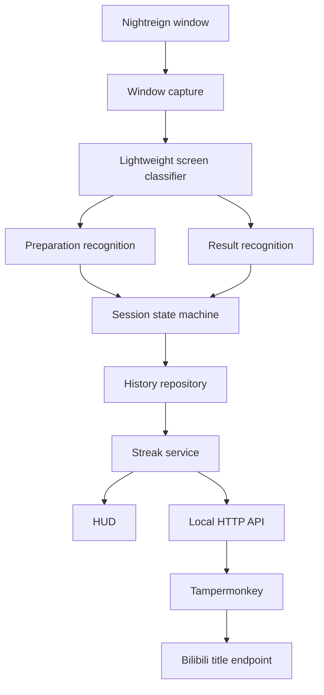
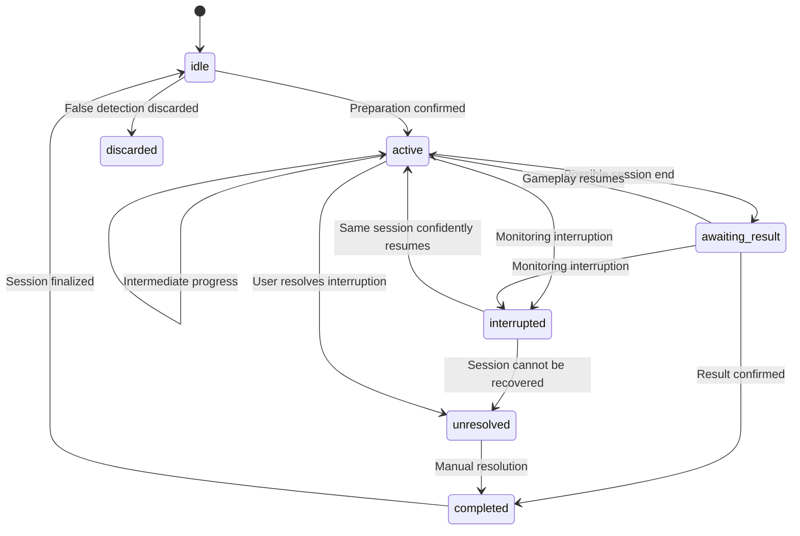

# Nightreign Challenge Tracker — Full Technical Specification

Version 1.0 · Windows desktop application

## 1. Project overview

### 1.1 Purpose

Develop a Windows desktop application that monitors Elden Ring Nightreign in real time, records game sessions, and tracks a 100-victory winning streak challenge using the Executor Nightfarer.

The application shall recognize game UI elements using OpenCV, maintain structured session history in YAML, display a transparent HUD over the game, and automatically synchronize the current challenge progress with a Bilibili livestream room title.

The application is intended to run during livestreams for extended periods. It must be performant, resilient to interruptions, and conservative when recognition is uncertain.

### 1.2 Challenge rules

A game session can finish at one of four progress levels:

- Day 1
- Day 2
- Day 3
- Day 3 victory

A session is a victory only when the player completes Day 3 and the result screen confirms victory.

The challenge rules are:

1. An Executor victory increments the current streak by one.
2. Any finalized Executor non-victory resets the current streak to zero.
3. Sessions played with other Nightfarers do not increment or reset the Executor streak.
4. Uncertain or interrupted sessions do not affect the streak until resolved.
5. Correcting or discarding a session must cause affected statistics to be reconciled.
6. Historical streak labels remain associated with the original completed victories, even after subsequent resets.
7. The target is 100 consecutive Executor victories. At 100, the title remains at `100/100`; further sessions may still be recorded, but the challenge counter shall not exceed 100 unless a future configuration explicitly changes this behavior.

### 1.3 Goals

- Recognize the selected Nightfarer and base Nightlord on the preparation screen.
- Detect session starts, ends, and final progress.
- Identify the actual Nightlord variant on the result screen, including Everdark variants.
- Track the Executor streak accurately.
- Exclude other Nightfarers' sessions from streak calculations.
- Persist session history in a YAML file.
- Display active-session information and recent history in a transparent HUD.
- Update the Bilibili live-room title when the streak increments or resets.
- Reuse the existing authenticated browser session through Tampermonkey.
- Avoid Playwright and other browser automation processes.
- Minimize game performance impact through adaptive sampling and region-of-interest recognition.
- Support 16:9 game resolutions such as 1920×1080 and 2560×1440.

### 1.4 Non-goals

Version 1 does not need to:

- Automate gameplay.
- Analyze combat or intermediate combat events.
- Record gameplay video.
- Use a cloud database.
- Synchronize data across computers.
- Automate the Bilibili management page's DOM.
- Require Playwright or a separate browser instance.
- Infer a session outcome when the evidence is insufficient.

## 2. Platform and technology

| Component            | Requirement                                      |
| -------------------- | ------------------------------------------------ |
| Operating system     | Windows 10/11                                    |
| Game                 | Elden Ring Nightreign                            |
| Capture target       | Game window                                      |
| Screen recognition   | OpenCV                                           |
| Recognition approach | ROI-based template matching and image processing |
| Session processing   | Event-driven state machine                       |
| Persistence          | YAML                                             |
| HUD                  | Transparent, borderless, always-on-top window    |
| Local API            | HTTP, loopback only                              |
| Browser integration  | Tampermonkey userscript                          |
| Livestream platform  | Bilibili                                         |
| Title update         | Bilibili live-room update endpoint               |
| Authentication       | Existing authenticated browser session           |

The specific desktop UI framework, window-capture library, and Python packaging method are implementation choices. They must support reliable window capture, background processing, and a transparent Windows overlay.

## 3. Application architecture

The application shall be divided into independent modules with explicit interfaces.

| Module                  | Responsibility                                                                   |
| ----------------------- | -------------------------------------------------------------------------------- |
| Window capture          | Acquire frames from the Nightreign window                                        |
| Screen classifier       | Determine whether a preparation screen, result screen, or other state is visible |
| Recognition engine      | Identify Nightfarers, Nightlords, progress, victory, and variants                |
| Session state machine   | Manage session lifecycle and interruption recovery                               |
| Streak service          | Calculate current streak, historical labels, and challenge statistics            |
| History repository      | Load, validate, and save YAML data                                               |
| HUD                     | Display active session, streak, and recent history                               |
| Local API               | Expose the desired title and synchronization revision                            |
| Title synchronization   | Track title changes and report synchronization status                            |
| Tampermonkey userscript | Poll the local API and update the Bilibili title                                 |

### 3.1 Data flow

You're right. The previous diagrams used Mermaid-specific features such as `stateDiagram-v2` and special start-state syntax. Here are replacements using basic Mermaid flowcharts only, which are more widely supported across Markdown renderers.



The history repository and streak service are authoritative. Neither the HUD nor the userscript may independently calculate the streak.

Recognition shall not directly modify YAML files. It emits classification results or events to the session state machine, which validates transitions and delegates persistence and streak updates.

### 3.2 Concurrency

Capture, recognition, HUD rendering, persistence, and title synchronization must not block one another.

- The capture pipeline shall use a bounded queue.
- At most one recognition job may be pending.
- If recognition falls behind, stale frames shall be discarded.
- State changes shall be serialized through a single state-management path.
- YAML writes shall be coordinated to avoid concurrent modification.
- Network retries shall not block the recognition pipeline.

## 4. Screen capture and performance

### 4.1 Capture requirements

The application shall capture only the Nightreign window.

It shall detect when the target window is unavailable, minimized, or inaccessible. A capture failure shall not automatically end a session or count as a defeat.

The implementation shall be tested with the game's actual display mode. Window capture must be compatible with the selected capture API and the user's graphics configuration.

### 4.2 Performance principles

The recognition workload shall be minimized by:

- Using a lightweight screen classifier before detailed recognition.
- Processing only relevant regions of interest (ROIs).
- Avoiding full-screen template matching for individual entities.
- Reusing preprocessed templates.
- Avoiding repeated color-space conversions.
- Running recognition on a background worker.
- Reducing sampling frequency during gameplay.
- Skipping stale frames when the system is overloaded.
- Performing detailed recognition only when a likely preparation or result screen is detected.

The application shall not analyze every frame at the game's rendering rate.

### 4.3 Adaptive sampling

Initial configurable sampling intervals:

| State                 | Interval               | Processing                                             |
| --------------------- | ---------------------- | ------------------------------------------------------ |
| Idle                  | 1,000 ms               | Lightweight screen classification                      |
| Preparation candidate | 200 ms                 | Confirm preparation screen and identify entities       |
| Active gameplay       | 1,000 ms               | Lightweight classification for possible state changes  |
| Result candidate      | 200 ms                 | Confirm final progress, victory, and Nightlord variant |
| Monitoring paused     | No routine recognition | Wait for resume                                        |

These are starting values to benchmark, not guaranteed optimal settings. They shall be configurable independently.

A screen candidate shall be confirmed across multiple observations before a session starts or ends. Recognition may use different thresholds for screen classification, entity identity, and variant classification.

### 4.4 Performance acceptance criteria

The application shall be benchmarked at 1920×1080 and 2560×1440.

- No unbounded frame or recognition-job queue.
- No detailed recognition on every frame during gameplay.
- No unnecessary full-resolution image processing.
- No blocking of the HUD or local API by recognition.
- CPU usage and memory usage measured during a representative 30–50 minute session.
- Game frame rate measured against a baseline with monitoring disabled.
- Stale frames discarded under load rather than accumulating latency.
- Recognition accuracy verified at both resolutions.

The implementation shall document benchmark results. It should minimize performance impact rather than promise a fixed overhead before measurement.

## 5. Resolution-independent recognition

### 5.1 Supported aspect ratio

The game capture is assumed to remain at a 16:9 aspect ratio. Resolution may vary.

All ROI coordinates shall be expressed as normalized coordinates relative to the captured game window.

For a normalized rectangle \\((x,y,w,h)\\) and captured frame dimensions \\(W \times H\\):

\\[ \begin{aligned} x\_{\mathrm{px}} &= \operatorname{round}(xW)\\\ y\_{\mathrm{px}} &= \operatorname{round}(yH)\\\ w\_{\mathrm{px}} &= \operatorname{round}(wW)\\\ h\_{\mathrm{px}} &= \operatorname{round}(hH) \end{aligned} \\]

Each normalized coordinate is between 0 and 1.

The implementation shall derive pixel coordinates from the current captured frame dimensions rather than hardcoding 1920×1080 coordinates.

### 5.2 ROI configuration

The following values define the intended configuration format. They are provisional regions, not final calibrated coordinates.

```
capture:
  aspect_ratio: "16:9"
  resolution_independent: true

recognition:
  sampling:
    idle_ms: 1000
    preparation_ms: 200
    gameplay_ms: 1000
    result_ms: 200

  regions:
    preparation_nightlord: [0.00, 0.00, 0.18, 0.16]
    preparation_nightfarers: [0.04, 0.24, 0.29, 0.24]
    result_progress: [0.68, 0.12, 0.28, 0.10]
    result_nightlord_search: [0.00, 0.55, 0.35, 0.40]
```

Final coordinates shall be calibrated using actual screenshots. The result-screen Nightlord ROI must cover the possible icon locations within the scrollable panel.

### 5.3 Template scaling

ROI normalization and template scaling are separate concerns.

The recognition engine shall:

1. Crop the relevant ROI from the original captured frame.
2. Resize the crop to a canonical recognition size where appropriate.
3. Match against preprocessed templates.
4. Use a limited set of template scales only when required.
5. Preserve sufficient detail for small icons and color classification.
6. Validate accuracy at each supported resolution.

A full frame may be downsampled for lightweight screen classification. Detailed Nightlord recognition should use a crop from the original-resolution frame before resizing that crop.

Templates shall be precomputed and cached. They shall not be regenerated on each recognition iteration.

## 6. Recognition requirements

### 6.1 Supported screen states

The recognition engine shall classify frames into the following categories:

- `preparation`
- `result`
- `gameplay_or_transition`
- `unknown`

A separate confidence score shall be maintained for screen classification and for each recognized entity or result.

The recognition engine shall not treat an unknown screen as evidence that a session has ended.

### 6.2 Nightfarer recognition

There are 10 Nightfarers. The selected character is indicated by a blue selection icon at the top-left of the corresponding character portrait on the preparation screen.

The recognition engine shall:

1. Detect the preparation screen.
2. Identify the portrait grid within the preparation-screen ROI.
3. Map each portrait's position to a configured Nightfarer identity.
4. Detect the blue selection indicator associated with a portrait.
5. Confirm that exactly one portrait is selected.
6. Return the selected Nightfarer and a confidence score.

The identity mapping shall be maintained as configuration or catalog data rather than embedded in unrelated recognition logic.

The implementation shall not identify a character solely from the central character model when the selection indicator provides more direct evidence.

If the selected portrait cannot be identified confidently, the session shall remain pending or be flagged for manual resolution.

### 6.3 Nightlord recognition on the preparation screen

The preparation screen displays the target Nightlord in the top-left corner.

The recognition engine shall:

1. Crop the configured target-panel ROI.
2. Extract the Nightlord icon and determine whether it is the dedicated hidden-Nightlord icon.
3. If it is not hidden, compare the icon with templates for the 10 base Nightlords and return the base identity and confidence.
4. Initialize the variant as `unknown`.

A special event may hide the session's Nightlord until the player is facing it. The event is indicated by a dedicated icon that is distinguishable from all Nightlord identity icons. When this icon is detected, record the session as having a hidden Nightlord and leave its base identity unknown; do not treat the marker as a Nightlord identity or as an uncertain match to one of the 10 base Nightlords. The actual identity remains unknown until it is recognized when the player faces the Nightlord, or from the result-screen icon if it was not recognized earlier.

The preparation screen displays the normal version of the Nightlord even when the actual encounter will use its Everdark variant. Therefore, the preparation screen must never be used to infer the final variant.

### 6.4 Result-screen progress recognition

The result screen displays the final day progress in the top-right area. A yellow victory indicator identifies victory.

The recognition engine shall distinguish these final outcomes:

| Stored value    | Meaning                                           |
| --------------- | ------------------------------------------------- |
| `day_1`         | Session ended at Day 1 without victory            |
| `day_2`         | Session ended at Day 2 without victory            |
| `day_3`         | Session ended at Day 3 without victory            |
| `day_3_victory` | Day 3 completed and victory confirmed             |
| `unknown`       | Final outcome could not be confidently determined |

The result screen's day label and victory indicator shall be treated as separate observations. The implementation shall not classify a session as a victory based on the day number alone.

If the day cannot be identified or the victory indicator is ambiguous, the result shall remain unresolved.

### 6.5 Nightlord recognition on the result screen

The result screen displays the actual Nightlord's icon in the bottom-left portion of the results panel. The icon's position may vary because the panel is scrollable.

The recognition engine shall:

1. Locate the relevant panel or search region.
2. Detect the Nightlord icon within that region.
3. Match the icon to the catalog of 10 base Nightlords.
4. Determine the variant by matching against the available normal and Everdark result-icon templates.
5. Reconcile the detected identity with the base identity recorded at session start, if one was known. A hidden-Nightlord marker at session start is not an identity conflict; record the result-screen identity as the actual Nightlord.

The implementation shall not assume a fixed vertical coordinate for the icon.

If the result-screen identity conflicts with the preparation-screen identity, the application shall flag the session for review instead of silently replacing one identity with another.

### 6.6 Everdark variant recognition

Eight of the 10 Nightlords have Everdark variants, and the template catalog contains separate result-screen icons for the normal and available Everdark variants.

The result-screen classifier shall compare the located icon directly against the catalog's normal and Everdark templates. For each Nightlord, it shall select the variant with the higher template-match score, then validate that score and the margin over the alternate variant using configurable thresholds.

The classifier shall:

- Support `normal`, `everdark`, and `unknown` results.
- Return `unknown` if the identity score is too low or the normal/Everdark score margin is ambiguous.
- Enforce the catalog rule that a Nightlord without an Everdark template cannot be classified as Everdark.
- Keep base-identity confidence and variant-score margin available for diagnostics.

Variant recognition shall use the existing variant-specific icon templates; no separate color-tint classifier is required.

### 6.7 Recognition catalogs

The application shall maintain a catalog of the 10 base Nightlords, their display names, their normal icon templates, and whether an Everdark variant exists.

The recognition catalog shall also include the dedicated hidden-Nightlord icon as a special marker, not as an eleventh base Nightlord.

Each catalog entry should support:

- Stable identifier.
- Display name.
- Normal result-icon template.
- Everdark availability and result-icon template when one exists.
- Optional per-variant confidence thresholds.

The exact catalog and Nightfarer names shall be validated against the game's current roster before release.

### 6.8 Confidence and debounce

Recognition confidence thresholds shall be configurable separately for:

- Screen classification.
- Nightfarer identity.
- Nightlord base identity.
- Final progress.
- Victory detection.
- Everdark variant.

A candidate state transition shall require multiple consistent observations. The number of confirmations and timing rules shall be configurable.

Debouncing shall prevent duplicate sessions and duplicate finalization without adding unnecessary delay to the entire recognition pipeline.

## 7. Session lifecycle

### 7.1 Session definition

A session represents one attempt that begins at a confirmed preparation screen and ends at a confirmed result, or remains unresolved if it is interrupted.

The application shall assign each session a stable, unique ID.

Each session shall record:

- Start timestamp.
- End timestamp, if known.
- Nightfarer.
- Nightlord base identity.
- Nightlord variant.
- Final progress.
- Lifecycle status.
- Whether it affects the Executor streak.
- Historical streak number, if applicable.
- Optional recognition confidence and manual-resolution metadata.

### 7.2 Lifecycle states

| State             | Description                                                          |
| ----------------- | -------------------------------------------------------------------- |
| `idle`            | No active session                                                    |
| `active`          | A session is in progress                                             |
| `awaiting_result` | A possible session end has been detected, but no result is confirmed |
| `interrupted`     | Monitoring stopped or the application restarted during a session     |
| `unresolved`      | The session cannot be automatically resolved                         |
| `completed`       | A final result has been confirmed and persisted                      |
| `discarded`       | A false detection has been explicitly discarded                      |

The implementation may represent lifecycle state and finalization status in separate fields if that simplifies recovery. The externally observable behavior must remain equivalent.

### 7.3 State transitions



The diagram is conceptual. The implementation shall explicitly validate transitions and prevent invalid state changes.

### 7.4 Start detection

A session begins when:

1. The preparation screen is recognized.
2. The selected Nightfarer is identified with sufficient confidence.
3. The base Nightlord is identified with sufficient confidence.
4. The candidate screen has passed debounce validation.
5. No other active session exists.

If a preparation screen appears while a session is active, it shall not automatically create another session. The state machine must first determine whether the existing session ended, whether this is a new attempt, or whether the screen is a false detection.

### 7.5 End detection

A session ends when a supported result screen is confidently recognized and the result is accepted by the state machine.

The end timestamp shall correspond to the time the result is confirmed, not the time the YAML write finishes.

The application shall not infer a loss from:

- The game window closing.
- The game being minimized.
- A capture failure.
- A long period without recognized screens.
- An application restart.

These conditions may trigger an interruption state but not a final outcome.

### 7.6 Session finalization

Finalization shall be an idempotent operation: processing the same result more than once must not create duplicate history entries or apply the streak change multiple times.

A session is finalized only after the required result fields are sufficiently certain or the user explicitly resolves it under the manual-resolution policy.

The application shall update the session record and derived statistics consistently, then refresh the HUD and desired title.

### 7.7 Manual controls

Version 1 shall expose the following controls:

Pause / resume monitoring

- Stop routine capture and recognition processing.
- Preserve the active session and its last confirmed information.
- Do not finalize the session or change the streak because of the pause.
- On resume, reacquire the game window and cautiously reconcile the visible screen with the stored state.

Skip false detection

- Discard a detected session that does not represent a real game session.
- Prevent the discarded detection from affecting streak statistics.
- If the session has already been persisted, mark it as discarded rather than silently deleting historical evidence.
- Recompute affected statistics and synchronize the title if the effective streak changes.

Uncertain or interrupted sessions shall be preserved for manual resolution. The session model shall support manually correcting the Nightfarer, Nightlord, variant, progress, and timestamps where needed. A dedicated correction interface may be implemented as a companion panel.

The manual-resolution UI shall require an explicit outcome for unresolved Executor sessions before they can affect the streak. An unresolved outcome must never be silently treated as either a victory or a loss.

## 8. Winning streak calculation

### 8.1 Authoritative rules

The streak service shall calculate the challenge state from the chronologically ordered, non-discarded session history.

For sessions that affect the challenge:

| Nightfarer           | Final outcome         | Effect                       |
| -------------------- | --------------------- | ---------------------------- |
| Executor             | Day 3 victory         | Increment current streak     |
| Executor             | Day 1                 | Reset current streak to zero |
| Executor             | Day 2                 | Reset current streak to zero |
| Executor             | Day 3 without victory | Reset current streak to zero |
| Executor             | Unknown or unresolved | No effect until resolved     |
| Any other Nightfarer | Any outcome           | No effect                    |

The `all_nonvictories` failure rule means that every finalized Executor result other than a confirmed victory resets the streak. This includes a known non-victory at any day and a manually resolved non-victory.

A non-Executor session does not break the streak, even if it ends in a loss.

### 8.2 Statistics

The streak service shall maintain:

- `current_streak`: number of consecutive eligible Executor victories since the latest finalized Executor non-victory.
- `best_streak`: highest streak reached in the recorded history.
- `total_executor_victories`: total finalized Executor victories, regardless of streak resets.
- `target`: challenge target, initially 100.

The active streak is derived from completed, non-discarded Executor sessions. Unresolved sessions do not contribute.

### 8.3 Historical streak labels

The HUD shall display historical streak labels for completed Executor victories. The labels must not change merely because a subsequent loss resets the current streak.

For example:

```
#15 Executor - Harmonia - Victory
#14 Executor - Tricephalos - Victory
Revenant - Adel - Day 2
#13 Executor - Heolstor - Victory
```

The Revenant session has no Executor streak number and does not break the Executor streak.

The displayed number is the historical streak position of that victory, not a global session number.

### 8.4 Corrections and recomputation

If a session is corrected, discarded, or moved in chronological order, the streak service shall recompute the affected derived statistics from the authoritative history.

A correction to an earlier session may change the historical streak positions of subsequent victories. The application shall not preserve contradictory cached labels simply to avoid changing existing records.

### 8.5 Target completion

The target is 100 consecutive Executor victories.

When the current streak reaches 100:

- The HUD shall indicate completion.
- The Bilibili title shall show `(100/100)`.
- The title shall remain `(100/100)` after later sessions, according to the selected keep-at-target behavior.
- Session monitoring and history recording shall continue.
- The counter displayed for the challenge shall remain capped at 100.

For a target of 100, the title template shall therefore render the capped challenge progress rather than an unbounded post-completion count.

## 9. YAML persistence

### 9.1 Storage requirements

The application shall store structured session history in a local YAML file.

The history file shall reside at the project root beside `config.yaml`, not in the game installation directory or the Windows user's application-data directory. Mutable runtime state, including HUD geometry and desired-title revision and synchronization status, shall be persisted in a Pydantic-validated project-root `state.json` file. Invalid state data shall be ignored and replaced by defaults on the next state save.

The repository shall:

- Load and validate history at startup.
- Create a new history file if none exists.
- Preserve the original file when parsing or validation fails.
- Write updates atomically where practical.
- Use a stable schema version.
- Support migration from earlier schemas.
- Recover cached statistics from authoritative session records.
- Avoid concurrent writes and duplicate finalization.

The application shall not claim a save succeeded until the persistence operation has succeeded.

### 9.2 Proposed schema

```
schema_version: 1

challenge:
  target: 100
  current_streak: 15
  best_streak: 15
  total_executor_victories: 15

sessions:
  - id: "session-00015"
    started_at: "2026-10-02T14:20:00+08:00"
    ended_at: "2026-10-02T15:02:00+08:00"

    nightfarer: "Executor"

    nightlord:
      hidden: false
      base_name: "Harmonia"
      variant: "everdark"

    progress: "day_3_victory"
    status: "completed"

    counts_for_streak: true
    streak_number: 15
```

This is an illustrative record, not an assertion about an actual session.

### 9.3 Field definitions

| Field                                | Type              | Description                                                       |
| ------------------------------------ | ----------------- | ----------------------------------------------------------------- |
| `schema_version`                     | Integer           | Schema version                                                    |
| `challenge.target`                   | Integer           | Target streak                                                     |
| `challenge.current_streak`           | Integer           | Cached current streak                                             |
| `challenge.best_streak`              | Integer           | Cached historical maximum                                         |
| `challenge.total_executor_victories` | Integer           | Cached total Executor victories                                   |
| `sessions[].id`                      | String            | Stable unique session ID                                          |
| `sessions[].started_at`              | Timestamp         | Session start time                                                |
| `sessions[].ended_at`                | Timestamp or null | Confirmed end time                                                |
| `sessions[].nightfarer`              | String or null    | Identified Nightfarer                                             |
| `sessions[].nightlord.hidden`        | Boolean           | Whether the preparation screen showed the hidden-Nightlord marker |
| `sessions[].nightlord.base_name`     | String or null    | Base Nightlord identity                                           |
| `sessions[].nightlord.variant`       | Enum              | `normal`, `everdark`, or `unknown`                                |
| `sessions[].progress`                | Enum or null      | Final progress                                                    |
| `sessions[].status`                  | Enum              | Lifecycle state                                                   |
| `sessions[].counts_for_streak`       | Boolean           | Whether the session affects streak calculation                    |
| `sessions[].streak_number`           | Integer or null   | Historical streak position for a victory                          |

Additional fields should support recognition confidence, manual corrections, and discard metadata.

### 9.4 Data consistency

The session list is authoritative. The challenge summary is a cached projection that must be reproducible from the records.

The repository and streak service shall use a consistent transaction-like update sequence. If the application crashes during an update, startup reconciliation shall recompute derived statistics from the persisted session history.

A schema migration from an older representation in which the Nightlord is stored as a plain string shall preserve the base name and set the variant to `unknown`. It must not assume that a historical encounter was normal.

### 9.5 Timestamp handling

All persisted timestamps shall include timezone information. The HUD shall display timestamps in the user's configured local timezone using the format:

`YYYY/MM/DD HH:mm:ss`

Timestamps shall use a consistent chronological basis when sorting and recomputing streaks.

## 10. Transparent HUD

### 10.1 Appearance and layout

The HUD shall be a transparent, borderless, always-on-top Windows window.

It shall display:

1. The current active session.
2. The current streak and target.
3. Recent completed sessions in reverse chronological order.
4. Each session's start timestamp.
5. Synchronization status when enabled.

The number of history entries shall depend on the available panel height. The layout shall adapt to changes in panel size and font size.

### 10.2 Display format

Example:

```
Current: Executor - Heolstor

#12 Executor - Tricephalos - Victory
2026/10/01 10:30:30

Revenant - Adel - Day 2
2026/10/01 09:45:12

#11 Executor - Everdark Libra - Victory
2026/10/01 08:15:45

#10 Executor - Everdark Tricephalos - Victory
2026/10/01 07:00:00
```

### 10.3 Current-session display

The current line shall show the selected Nightfarer and the Nightlord's base name.

Examples:

```
Current: Executor - Harmonia
Current: Revenant - Adel
Current: Executor - Hidden Nightlord
No active session
```

When the hidden-Nightlord marker was detected and the actual identity is not yet known, display `Hidden Nightlord` instead of an unknown or guessed base name. Replace it with the recognized identity once the player is facing the Nightlord or the result-screen icon identifies it.

The current line shall not show `Everdark Harmonia` before the result screen confirms the variant.

### 10.4 Completed-session display

After finalization, the history entry shall show the confirmed Nightlord variant:

- Normal: `Harmonia`
- Everdark: `Everdark Harmonia`
- Unknown variant: `Harmonia (?)`

The final progress shall be displayed using concise labels such as `Victory`, `Day 1`, `Day 2`, and `Day 3`.

Other Nightfarers' sessions shall not have an Executor streak number.

### 10.5 HUD controls

The HUD or its companion control panel shall provide:

- Pause / resume monitoring.
- Skip false detection.
- Access to unresolved sessions for manual resolution.
- Configuration access or a link to the configuration interface.

The overlay should be movable and resizable. Opacity, font size, width, and spacing shall be configurable.

If the selected Windows framework supports excluding the overlay from capture, that behavior may be offered as a configurable option. It must be tested with the user's streaming software and capture method rather than assumed to work universally.

## 11. Application configuration

Configuration shall be stored separately from session history.

Example `config.yaml`:

```
capture:
  target_window: "Nightreign"
  interval_ms: 1000
  aspect_ratio: "16:9"
  resolution_independent: true

recognition:
  screen_confidence_threshold: 0.90
  entity_confidence_threshold: 0.92
  variant_confidence_threshold: 0.90
  consecutive_confirmations: 3

  sampling:
    idle_ms: 1000
    preparation_ms: 200
    gameplay_ms: 1000
    result_ms: 200

hud:
  opacity: 0.85
  font_size: 16
  recent_sessions: 10

streak:
  target: 100
  eligible_nightfarer: "Executor"

api:
  host: "127.0.0.1"
  port: 5678

bilibili:
  title_template: "Nightreign Winning Streak Challenge ({current_streak}/100)"
  polling_interval_seconds: 5
```

All confidence thresholds are initial tuning values, not validated production settings.

The configuration loader shall validate values and report invalid settings clearly. Unsupported configuration versions shall not be silently overwritten.

## 12. Local HTTP API

### 12.1 Endpoint

The tracker shall expose a read-only endpoint:

`GET http://127.0.0.1:5678/api/streak`

The host, port, and base path shall be configurable.

Example response:

```
{
  "schema_version": 1,
  "current_streak": 15,
  "target": 100,
  "desired_title": "Nightreign Winning Streak Challenge (15/100)",
  "revision": 42
}
```

### 12.2 Response semantics

- `current_streak` is the capped challenge count.
- `target` is the configured challenge target.
- `desired_title` is generated by the tracker.
- `revision` increases whenever the desired title changes.

The revision shall be persisted or reconstructed safely across restarts so that the userscript can always obtain the latest desired title. A browser reconnect shall not require the tracker to generate a new streak event.

### 12.3 Security and reliability

- Bind to `127.0.0.1` by default.
- Expose no arbitrary title-update endpoint.
- Return structured JSON errors.
- Validate the userscript's request and response assumptions.
- Keep the endpoint responsive while recognition is running.
- Avoid exposing Bilibili credentials, cookies, or CSRF tokens.

Because the endpoint is intended for a local userscript, CORS handling should be documented explicitly. The userscript should use Tampermonkey's privileged request mechanism rather than relying on the Bilibili page's normal `fetch()` permissions.

## 13. Bilibili title synchronization

### 13.1 Integration design

The application shall update the livestream room title through Bilibili's live-room update endpoint, using a Tampermonkey userscript running in the user's existing authenticated browser session.

The tracker shall not launch a browser or automate the management page's DOM.

The intended flow is:

```
Tracker
  |
  | GET local streak state
  v
Tampermonkey
  |
  | POST authenticated title update
  v
Bilibili live-room API
  |
  v
Updated live-room title
```

### 13.2 Endpoint

Proposed endpoint:

`POST https://api.live.bilibili.com/room/v1/Room/update`

Expected form-urlencoded fields:

| Field     | Description                                          |
| --------- | ---------------------------------------------------- |
| `room_id` | Target live-room ID                                  |
| `title`   | Desired room title                                   |
| `csrf`    | CSRF token associated with the authenticated session |

The userscript shall use the existing authenticated Bilibili session. It shall not store passwords or session cookies in the tracker.

Release prerequisite: verify the current endpoint, required fields, CSRF behavior, cookie handling, and response schema against the actual Bilibili account and browser. A successful HTTP response alone shall not be considered proof of success; the application-level response must also indicate success.

### 13.3 Title template

Default template:

```
Nightreign Winning Streak Challenge ({current_streak}/100)
```

The title shall update on:

- Executor victory increments.
- Executor non-victory resets.
- Manual corrections that change the effective streak.
- Startup reconciliation if the desired title differs from the last synchronized state.

Sessions with other Nightfarers shall not cause a title change unless reconciliation establishes that the effective streak has changed.

### 13.4 Title submission and completion

The application shall submit the generated title without local title-length validation or truncation. If Bilibili rejects the title, the application shall report the synchronization failure.

At 100 victories, the title shall remain:

```
Nightreign Winning Streak Challenge (100/100)
```

The tracker shall continue recording sessions without changing the challenge display beyond its configured target.

### 13.5 Tampermonkey userscript

The userscript shall:

1. Run on the configured Bilibili live-room management page.
2. Poll the local API every five seconds by default.
3. Validate the returned JSON.
4. Compare the revision and desired title with the last successfully synchronized state.
5. Obtain the current CSRF token from the authenticated browser context.
6. Submit the title update using Tampermonkey's privileged HTTP API.
7. Validate HTTP and application-level success.
8. Mark the revision as processed only after confirmed success.
9. Retry transient failures using bounded exponential backoff.
10. Resume synchronization after a page reload or network interruption.

It shall not submit an unchanged title on every poll.

### 13.6 Authentication and browser lifecycle

The user must be authenticated in the browser where the userscript runs.

The integration shall verify that the selected Tampermonkey request mechanism sends the required cookies to Bilibili. It must not assume that privileged cross-origin requests automatically carry the correct authentication.

If the session expires, the userscript shall report an authentication failure and wait for reauthentication.

If the management page is closed or the userscript is inactive, the tracker shall continue running. Title synchronization shall resume when the userscript becomes active again.

### 13.7 Synchronization status

The application should expose one of the following states:

- `Synced`
- `Pending`
- `Retrying`
- `Authentication required`
- `Title rejected`
- `Offline`

Title synchronization must never block recognition, session finalization, YAML persistence, or streak calculations.

## 14. Error handling and recovery

| Failure                          | Required behavior                                         |
| -------------------------------- | --------------------------------------------------------- |
| Game window unavailable          | Suspend recognition and preserve the active session       |
| Game window minimized            | Avoid interpreting missing frames as a defeat             |
| Unknown screen                   | Retain confirmed state; do not infer a result             |
| Nightfarer uncertain             | Keep identification pending or flag for manual resolution |
| Nightlord identity uncertain     | Preserve the session with an unresolved identity          |
| Variant uncertain                | Store `unknown`; do not guess normal or Everdark          |
| Progress uncertain               | Keep the session unresolved                               |
| Conflicting Nightlord identities | Flag for manual review                                    |
| Application crash                | Recover persisted history on restart                      |
| Interrupted active session       | Resume cautiously or preserve as unresolved               |
| Malformed YAML                   | Preserve the original file and report the error           |
| Disk write failure               | Report failure and avoid claiming persistence succeeded   |
| Local API unavailable            | Continue tracking and retry synchronization               |
| Bilibili request fails           | Retain the desired title and retry                        |
| Authentication expires           | Report the error and wait for reauthentication            |
| Duplicate recognition            | Prevent duplicate sessions and duplicate streak changes   |
| False detection discarded        | Exclude it from all streak calculations                   |
| Manual correction                | Reconcile history, statistics, HUD, and desired title     |
| Recognition overloaded           | Drop stale frames rather than accumulating latency        |

Diagnostic logs should include timestamps, screen classifications, confidence values, state transitions, and synchronization outcomes. Logs must not contain passwords, session cookies, CSRF tokens, or other authentication secrets.

## 15. Testing and acceptance criteria

### 15.1 Recognition tests

- Recognize the preparation screen at 1920×1080.
- Recognize the preparation screen at 2560×1440.
- Identify each of the 10 Nightfarers from the blue selection indicator.
- Identify all 10 base Nightlords.
- Recognize Day 1, Day 2, and Day 3 results.
- Distinguish Day 3 victory from Day 3 non-victory.
- Distinguish normal and Everdark icons.
- Handle uncertain and conflicting classifications without guessing.
- Detect the Nightlord icon despite its variable vertical position in the result panel.
- Avoid duplicate detections when the same screen remains visible.
- Validate template scaling and color classification at both resolutions.

### 15.2 Session lifecycle tests

- A confirmed preparation screen creates exactly one session.
- The session start timestamp is recorded.
- Intermediate day transitions do not prematurely finalize a session.
- A confirmed result finalizes the session exactly once.
- Loss of capture does not count as a non-victory.
- Pausing does not finalize an active session.
- Resuming reconciles the visible screen without creating duplicate sessions.
- Restarting the application preserves recoverable session state.
- False detections can be discarded without affecting the streak.
- Interrupted sessions remain available for manual resolution.

### 15.3 Streak tests

- An Executor victory increments the current streak.
- Every finalized Executor non-victory resets the streak to zero.
- Other Nightfarers neither increment nor reset the Executor streak.
- An unresolved session has no effect until resolved.
- Historical labels remain stable after subsequent streak resets.
- Corrections and discarded records trigger consistent recomputation.
- `best_streak` and `total_executor_victories` match the authoritative history.
- The challenge count never exceeds 100 under the default configuration.
- Completion leaves the displayed challenge progress at `100/100`.

### 15.4 Persistence tests

- A missing history file is initialized safely.
- Malformed YAML is not silently overwritten.
- Session records survive application restart.
- Derived statistics are reconstructed correctly.
- Schema migration preserves historical Nightlord identities and timestamps.
- Interrupted writes do not leave a partially written file presented as valid history.

### 15.5 HUD tests

- The overlay is transparent and remains above the game.
- The active session displays the base Nightlord name.
- Finalized sessions display the confirmed variant.
- Recent sessions appear newest first.
- Historical entries adapt to panel height.
- The pause and skip controls work.
- HUD updates do not block recognition.
- Capture exclusion, if supported, is verified with the actual streaming software.

### 15.6 Bilibili integration tests

- The userscript retrieves current streak state from the local API.
- The initial title is synchronized after startup.
- An Executor victory updates the title.
- An Executor non-victory resets the title to `0/100`.
- Other Nightfarers do not trigger an unnecessary title change.
- Manual corrections update the title when appropriate.
- The title remains `100/100` after challenge completion.
- Repeated polling does not submit an unchanged title.
- Network failures are retried without blocking tracking.
- Authentication failures are reported clearly.
- Generated titles are submitted without local title-length validation or truncation.
- Synchronization resumes after the browser or network reconnects.

### 15.7 Performance tests

- Capture and recognition are measured during a representative 30–50 minute session.
- CPU and memory usage are recorded at both supported resolutions.
- Game frame rate is compared with monitoring enabled and disabled.
- Recognition does not accumulate an unbounded backlog.
- Detailed matching is restricted to relevant screen states and ROIs.
- The HUD and local API remain responsive under recognition load.

## 16. Implementation plan

1. Recognition prototype

   Implement window capture, normalized ROI extraction, screen classification, Nightfarer selection detection, and base Nightlord matching. Validate the approach using the supplied screenshots and additional real gameplay captures.

2. Result and variant recognition

   Implement progress and victory detection, scrollable-panel icon localization, and normal/Everdark classification. Build a test set covering the 10 base Nightlords and available Everdark variants.

3. Session state machine

   Implement preparation detection, active-session tracking, result confirmation, interruption recovery, debouncing, and duplicate prevention.

4. History and streak service

   Implement the YAML schema, atomic persistence, migration, historical streak labels, the `all_nonvictories` rule, and recomputation after corrections.

5. HUD and manual controls

   Implement the transparent overlay, responsive history layout, pause/resume, skip, and unresolved-session handling.

6. Local API and Bilibili synchronization

   Implement the local status endpoint and Tampermonkey userscript. Validate the current Bilibili endpoint contract, authentication, CSRF handling, and title restrictions.

7. Integration and performance testing

   Run end-to-end tests at both resolutions, verify streak correctness through simulated sessions, and benchmark overhead during real gameplay.

## 17. Outstanding implementation-time validation

The architecture and behavioral requirements are sufficiently specified to begin implementation. The following details still require empirical validation:

1. Recognition templates: obtain representative screenshots for every Nightfarer, every base Nightlord, and the available Everdark variants.
2. ROI calibration: finalize normalized coordinates from actual captures at 16:9 resolutions.
3. Capture compatibility: verify the chosen Windows capture API with Nightreign's actual display mode.
4. Variant template scoring: validate direct normal/Everdark template-match margins across available variants and add real captures where the scores are ambiguous.
5. Bilibili API: verify the live-room update endpoint, authentication requirements, CSRF behavior, and response schema.
6. Manual resolution: implement the correction workflow for interrupted or uncertain sessions, including how the user explicitly resolves an Executor session whose outcome cannot be recovered.
7. Performance baseline: establish measurable CPU, memory, and frame-rate overhead targets after profiling the initial prototype.

These are validation and tuning tasks, not reasons to delay the initial implementation.

The key design principle is to keep recognition, session accounting, persistence, presentation, and livestream synchronization independent. This ensures that an uncertain icon, interrupted capture, or failed network request cannot silently turn into an incorrect streak result.
